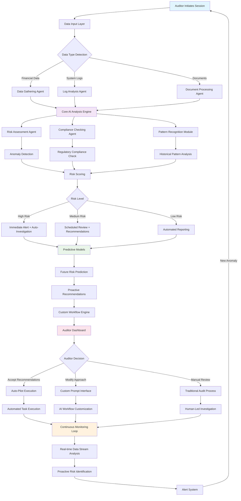

# AI Audit System - Functional Flow

This diagram shows how the different AI components work together to provide comprehensive audit capabilities.

## Key Components:

### 1. **Data Input & Processing**

- Multiple data sources (financial, logs, documents)
- Specialized agents for each data type
- Intelligent data type detection

### 2. **Core AI Analysis Engine**

- Central processing hub for all audit data
- Integrates outputs from specialized agents
- Performs comprehensive analysis

### 3. **Intelligent Agent Network**

- **Data Gathering Agent**: Collects and preprocesses data
- **Risk Assessment Agent**: Evaluates potential risks
- **Compliance Checking Agent**: Ensures regulatory adherence
- **Pattern Recognition**: Identifies trends and anomalies

### 4. **Decision & Action Layer**

- Risk-based routing for different response levels
- Predictive modeling for future risk assessment
- Custom workflow engine for auditor preferences

### 5. **Continuous Monitoring**

- Real-time data stream analysis
- Proactive risk identification
- Automated feedback loop for continuous improvement

### 6. **Automation Levels**

- **Auto-Pilot**: Fully automated for low-risk, routine tasks
- **Semi-Automated**: AI recommendations with human oversight
- **Manual**: Traditional audit process for complex cases
