# WheezeAI - Technical Architecture & Data Flow

This diagram shows the complete technical stack and how data flows through the system.

```mermaid
graph TB
    subgraph "Frontend Layer"
        A[React Dashboard] --> B[TypeScript Components]
        B --> C[Vite Build System]
        C --> D[Authentication Context]
    end
    
    subgraph "API Gateway"
        E[FastAPI Backend] --> F[JWT Authentication]
        F --> G[Route Handlers]
        G --> H[Dependency Injection]
    end
    
    subgraph "AI Processing Layer"
        I[Core AI Engine] --> J[OpenAI GPT Integration]
        I --> K[Custom ML Models]
        I --> L[Vector Database]
        
        M[Agent Orchestrator] --> N[Data Gathering Agent]
        M --> O[Risk Assessment Agent]
        M --> P[Compliance Agent]
        
        Q[Predictive Analytics] --> R[Time Series Analysis]
        Q --> S[Pattern Recognition]
        Q --> T[Anomaly Detection]
    end
    
    subgraph "Data Processing"
        U[Data Ingestion API] --> V[File Upload Handler]
        U --> W[Real-time Stream Processor]
        U --> X[Document Parser]
        
        Y[Data Validation] --> Z[Schema Validation]
        Y --> AA[Data Cleaning]
        Y --> BB[Format Standardization]
    end
    
    subgraph "Database Layer"
        CC[PostgreSQL] --> DD[User Management]
        CC --> EE[Audit Sessions]
        CC --> FF[Analysis Results]
        
        GG[Vector Store] --> HH[Embeddings]
        GG --> II[Semantic Search]
        
        JJ[Redis Cache] --> KK[Session Storage]
        JJ --> LL[Real-time Data]
    end
    
    subgraph "External Integrations"
        MM[Third-party APIs] --> NN[Financial Data Sources]
        MM --> OO[Compliance Databases]
        MM --> PP[Regulatory APIs]
        
        QQ[Monitoring Services] --> RR[System Health]
        QQ --> SS[Performance Metrics]
        QQ --> TT[Error Tracking]
    end
    
    subgraph "Infrastructure"
        UU[Docker Containers] --> VV[Backend Services]
        UU --> WW[Database Services]
        UU --> XX[AI Processing Services]
        
        YY[Load Balancer] --> ZZ[Auto Scaling]
        YY --> AAA[Health Checks]
        
        BBB[Message Queue] --> CCC[Async Task Processing]
        BBB --> DDD[Real-time Notifications]
    end
    
    %% Data Flow Connections
    A --> E
    E --> I
    I --> U
    U --> Y
    Y --> CC
    
    I --> M
    M --> Q
    Q --> CC
    
    E --> MM
    MM --> U
    
    CC --> GG
    GG --> I
    
    I --> JJ
    JJ --> E
    
    E --> QQ
    QQ --> UU
    
    BBB --> I
    I --> BBB
    
    style I fill:#e1f5fe
    style M fill:#f3e5f5
    style Q fill:#e8f5e8
    style CC fill:#fff3e0
    style E fill:#fce4ec
    style A fill:#f1f8e9
```

## Technology Stack Details:

### **Frontend Technologies**
- **React 18**: Modern UI framework with hooks
- **TypeScript**: Type-safe development
- **Vite**: Fast build tool and dev server
- **Tailwind CSS**: Utility-first styling
- **React Query**: Server state management
- **React Router**: Client-side routing

### **Backend Technologies**
- **FastAPI**: Modern Python web framework
- **SQLAlchemy**: ORM for database operations
- **Alembic**: Database migration tool
- **Pydantic**: Data validation and serialization
- **JWT**: Token-based authentication
- **Uvicorn**: ASGI server

### **AI & Machine Learning**
- **OpenAI GPT-4**: Large language model integration
- **LangChain**: AI application framework
- **Hugging Face**: Custom model hosting
- **ChromaDB/Pinecone**: Vector database for embeddings
- **scikit-learn**: Traditional ML algorithms
- **pandas**: Data manipulation and analysis

### **Database & Storage**
- **PostgreSQL**: Primary relational database
- **Redis**: Caching and session storage
- **Vector Database**: Semantic search capabilities
- **MinIO/S3**: Object storage for files
- **Elasticsearch**: Full-text search (optional)

### **Infrastructure & DevOps**
- **Docker**: Containerization
- **Docker Compose**: Multi-container orchestration
- **GitHub Actions**: CI/CD pipeline
- **Nginx**: Reverse proxy and load balancing
- **Prometheus**: Monitoring and metrics
- **Grafana**: Observability dashboards

### **Message Queue & Async Processing**
- **Celery**: Distributed task queue
- **RabbitMQ/Redis**: Message broker
- **WebSockets**: Real-time communication
- **Server-Sent Events**: Live updates

## Data Flow Stages:

1. **Authentication**: JWT token validation and user context
2. **Data Ingestion**: File uploads, API integrations, real-time streams
3. **AI Processing**: Multi-agent analysis with specialized models
4. **Storage**: Structured data in PostgreSQL, vectors in specialized DB
5. **Real-time Updates**: WebSocket connections for live monitoring
6. **Caching**: Redis for performance optimization
7. **External Integration**: Third-party data sources and APIs